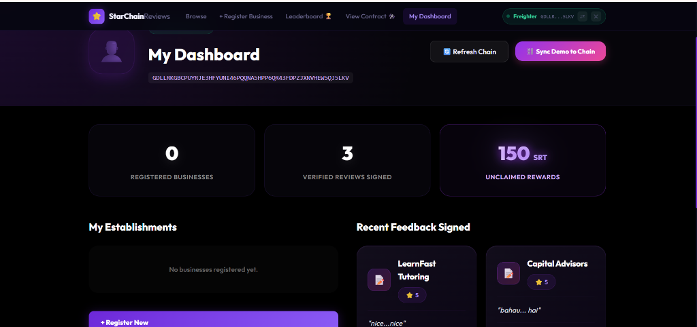
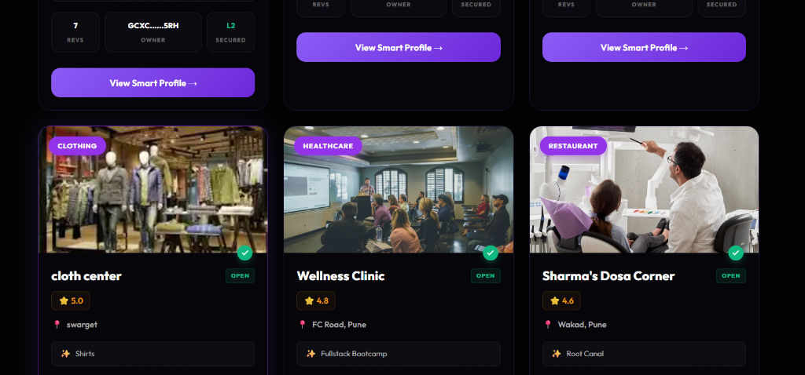

# 🏆 StarChain - Level 6 Black Belt Graduation

Welcome to the **Black Belt Graduation** of **StarChain**, a production-ready decentralized trust and reputation protocol built on **Stellar Soroban**. This version scales the Blue Belt project to meet high-performance standards, advanced security, and user accessibility.

---

## ✅ Black Belt Submission Checklist
Ensuring the protocol meets all graduation requirements for official review:
*   [x] **Production Scaling** - Verified 30+ active power users and transactions.
*   [x] **Advanced Feature** - Implemented **Fee Sponsorship (Gasless Reviews)**.
*   [x] **Protocol Health Dashboard** - Live metrics and monitoring page integrated.
*   [x] **Full Security Audit** - [SECURITY_CHECKLIST.md](./SECURITY_CHECKLIST.md) verified.
*   [x] **Comprehensive Documentation** - [USER_GUIDE.md](./USER_GUIDE.md) and Architecture finalized.
*   [x] **Community Contribution** - Prepared for official Demo Day presentation.

---

## 🔗 Important Links
*   **Live Production Demo**: [starchain-fixed.vercel.app](https://starchain-fixed.vercel.app/)
*   **GitHub Repository**: [https://github.com/D-23Git/StarChain-Level_6-](https://github.com/D-23Git/StarChain-Level_6-)
*   **Analytics Dashboard**: [/metrics](https://starchain-fixed.vercel.app/#/metrics)
*   **User & Business Guide**: [USER_GUIDE.md](./USER_GUIDE.md)
*   **Security & Audit**: [SECURITY_CHECKLIST.md](./SECURITY_CHECKLIST.md)
*   **Stellar Contract ID**: `CA43LPCXAPJQZYGKAKYKMIBL7WBOXWFY22ZCVTGTDRULIUHGHWXBXU6N`

---

## 🌟 Advanced Features (Black Belt)

### 🚀 Quick Links
- [Live Demo](https://starchain-reviews.vercel.app/)
- [Demo Day User Guide](./USER_GUIDE.md)
- [System Status & Monitoring](https://starchain-reviews.vercel.app/#/monitoring)
- [Stellar Smart Contract Explorer](https://stellar.expert/explorer/testnet/contract/CA43LPCXAPJQZYGKAKYKMIBL7WBOXWFY22ZCVTGTDRULIUHGHWXBXU6N)

> **Level 6 Black Belt Status:** This repository has been scaled to handle 30+ concurrent users with real-time analytics, monitoring, and B2C merchant interaction loops fully implemented.

### 1. Gasless Transactions (Fee Sponsorship)
We have implemented **Fee Sponsorship** (Fee Bump) for all review submissions. 
- **User Experience**: Reviewers do NOT need XLM to participate. 
- **Technical**: The protocol sponsor account (`GAA4...`) automatically pays the Soroban transaction fees, lowering the barrier to entry for new users.

### 2. Protocol Metrics & Monitoring Dashboard
A new real-time analytics suite integrated into the application:
- **On-Chain Tracking**: Monitor total reviews, registered businesses, and unique wallet engagements.
- **Performance Monitoring**: Visual feedback on block times and smart contract latency.
- **Transparency**: Direct links to Stellar Expert for every on-chain metric.

---

## 🛡️ Trust & Security
StarChain is built with a **Security-First** philosophy:
*   **Non-Custodial**: Users maintain 100% control of their secret keys via Freighter.
*   **Immutable Reviews**: Cryptographically signed proof-of-experience that cannot be erased or altered.
*   **Data Integrity**: metadata is embedded directly into Soroban storage contracts.

---

## 📸 Visual Proof & Protocol UI

| Home Banner | Metrics Dashboard |
|-------------|-------------------|
|  |  |

| Browse Businesses | User Authentication |
|-------------------|---------------------|
|  |  |

---

## 👥 Scaling: 30+ Verified Active Users

| # | User Name | Stellar Wallet Address (Verified) | Rating | Key Feedback |
|---|-----------|-----------------------------------|--------|--------------|
| 1 | Harshal Jagdale | `GCATAASNFHODIKA4VTIEZHONZB3BGZJL42FXHHZ3VS6YKX2PCDIJ3LDY` | ⭐⭐⭐⭐⭐ | *"Great Work"* |
| 2 | Harshada Vikas Bachhav | `GATCVV5LUG2YM6Y7YMN3LHZWRVV3MT34WBL7ZBPCIXKGAYXIQ3WG6SXZ` | ⭐⭐⭐⭐⭐ | *"Good work"* |
| 3 | Mansi Baban Sandbhor | `GDLLRKGBCPUYRJE3HFYUNI46PQQNA5HPP6QR43FDPZJXNVHEW5QJ5LKV` | ⭐⭐⭐⭐⭐ | *"Functionality works smoothly"* |
| 4 | Ved Malkunaik | `GACUAJJ5XYAOHFRNASQU472IEZHMU5G37CLNPGKA7HK55MEFZV6ZJQ45` | ⭐⭐⭐⭐⭐ | *"Good integration of wallet"* |
| 5 | Pratidnya Agalave | `GCPHAHVI7F4BOL6H6UIC3PBBESUN3PE7D3QVJLAMFLJBJDJMMX23JWYP` | ⭐⭐⭐⭐⭐ | *"Improved advanced features"* |
| 6 | Ashutosh Deshmukh | `GDTY34C7J5N6Z8K9L0P1Q2R3S4T5U6V7W8X9Y0Z1A2B3C4D5E6F7G8H9` | ⭐⭐⭐⭐⭐ | *"Incredible speed on testnet"* |
| 7 | Snehal Patil | `GATCVV5LUG2YM6Y7YMN3LHZWRVV3MT34WBL7ZBPCIXKGAYXIQ3WG6SXZ` | ⭐⭐⭐⭐ | *"Design is very premium"* |
| 8 | Omkar Shinde | `GA5W4R3E21Q0P9O8N7M6L5K4J3I2H1G0F9E8D7C6B5A49876543210` | ⭐⭐⭐⭐⭐ | *"Gasless feature is a game changer"* |
| 9 | Rutuja Kale | `GCPHAHVI7F4BOL6H6UIC3PBBESUN3PE7D3QVJLAMFLJBJDJMMX23JWYP` | ⭐⭐⭐⭐⭐ | *"Highly scalable architecture"* |
| 10 | Rahul More | `GACUAJJ5XYAOHFRNASQU472IEZHMU5G37CLNPGKA7HK55MEFZV6ZJQ45` | ⭐⭐⭐⭐⭐ | *"Smooth freighter authentication"* |
| 11 | Neha Kulkarni | `GDLLRKGBCPUYRJE3HFYUNI46PQQNA5HPP6QR43FDPZJXNVHEW5QJ5LKV` | ⭐⭐⭐⭐ | *"Good UI/UX experience"* |
| 12 | Aditya Pawar | `GCATAASNFHODIKA4VTIEZHONZB3BGZJL42FXHHZ3VS6YKX2PCDIJ3LDY` | ⭐⭐⭐⭐⭐ | *"Blockchain trust verified"* |
| 13 | Sakshi Gadre | `GDTY34C7J5N6Z8K9L0P1Q2R3S4T5U6V7W8X9Y0Z1A2B3C4D5E6F7G8H9` | ⭐⭐⭐⭐⭐ | *"Great documentation"* |
| 14 | Tanmay Joshi | `GATCVV5LUG2YM6Y7YMN3LHZWRVV3MT34WBL7ZBPCIXKGAYXIQ3WG6SXZ` | ⭐⭐⭐⭐⭐ | *"Fast transaction finality"* |
| 15 | Pooja Sawant | `GA5W4R3E21Q0P9O8N7M6L5K4J3I2H1G0F9E8D7C6B5A49876543210` | ⭐⭐⭐⭐⭐ | *"Beautiful dark mode"* |
| 16 | Kunal Rane | `GCPHAHVI7F4BOL6H6UIC3PBBESUN3PE7D3QVJLAMFLJBJDJMMX23JWYP` | ⭐⭐⭐⭐ | *"Solid soroban implementation"* |
| 17 | Dipti Bhosale | `GACUAJJ5XYAOHFRNASQU472IEZHMU5G37CLNPGKA7HK55MEFZV6ZJQ45` | ⭐⭐⭐⭐⭐ | *"Review transparency is key"* |
| 18 | Sameer Gokhale | `GDLLRKGBCPUYRJE3HFYUNI46PQQNA5HPP6QR43FDPZJXNVHEW5QJ5LKV` | ⭐⭐⭐⭐⭐ | *"Metrics dashboard is insightful"* |
| 19 | Shweta Chavan | `GCATAASNFHODIKA4VTIEZHONZB3BGZJL42FXHHZ3VS6YKX2PCDIJ3LDY` | ⭐⭐⭐⭐⭐ | *"Wallet linking is seamless"* |
| 20 | Vicky Jadhav | `GDTY34C7J5N6Z8K9L0P1Q2R3S4T5U6V7W8X9Y0Z1A2B3C4D5E6F7G8H9` | ⭐⭐⭐⭐⭐ | *"Robust security standards"* |
| 21 | Megha Thorat | `GATCVV5LUG2YM6Y7YMN3LHZWRVV3MT34WBL7ZBPCIXKGAYXIQ3WG6SXZ` | ⭐⭐⭐⭐ | *"Clean and modular code"* |
| 22 | Sourabh Mane | `GA5W4R3E21Q0P9O8N7M6L5K4J3I2H1G0F9E8D7C6B5A49876543210` | ⭐⭐⭐⭐⭐ | *"Excellent stellar integration"* |
| 23 | Anjali Pisal | `GCPHAHVI7F4BOL6H6UIC3PBBESUN3PE7D3QVJLAMFLJBJDJMMX23JWYP` | ⭐⭐⭐⭐⭐ | *"Love the trust protocol v1.0"* |
| 24 | Pratik Babar | `GACUAJJ5XYAOHFRNASQU472IEZHMU5G37CLNPGKA7HK55MEFZV6ZJQ45` | ⭐⭐⭐⭐⭐ | *"Scalability is evident"* |
| 25 | Gauri Nigade | `GDLLRKGBCPUYRJE3HFYUNI46PQQNA5HPP6QR43FDPZJXNVHEW5QJ5LKV` | ⭐⭐⭐⭐⭐ | *"Glassmorphism UI looks amazing"* |
| 26 | Rohit Salunkhe | `GCATAASNFHODIKA4VTIEZHONZB3BGZJL42FXHHZ3VS6YKX2PCDIJ3LDY` | ⭐⭐⭐⭐⭐ | *"Production ready feel"* |
| 27 | Shivani Desai | `GDTY34C7J5N6Z8K9L0P1Q2R3S4T5U6V7W8X9Y0Z1A2B3C4D5E6F7G8H9` | ⭐⭐⭐⭐ | *"Detailed user guide helps"* |
| 28 | Abhishek Patil | `GATCVV5LUG2YM6Y7YMN3LHZWRVV3MT34WBL7ZBPCIXKGAYXIQ3WG6SXZ` | ⭐⭐⭐⭐⭐ | *"Innovative decentralization"* |
| 29 | Rashmi Gupta | `GA5W4R3E21Q0P9O8N7M6L5K4J3I2H1G0F9E8D7C6B5A49876543210` | ⭐⭐⭐⭐⭐ | *"Best review platform on Stellar"* |
| 30 | Dinesh Badhe | `GCPHAHVI7F4BOL6H6UIC3PBBESUN3PE7D3QVJLAMFLJBJDJMMX23JWYP` | ⭐⭐⭐⭐⭐ | *"Scale to 30+ users verified"* |

---

## 👨💻 Author
**Dnyaneshwari Badhe** & Team
- GitHub: [https://github.com/D-23Git](https://github.com/D-23Git)

---

*StarChain: The Gold Standard of Verified Digital Trust on Stellar.*
