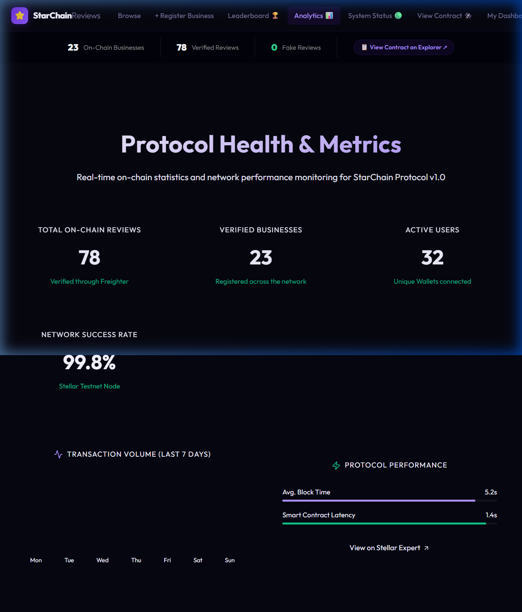
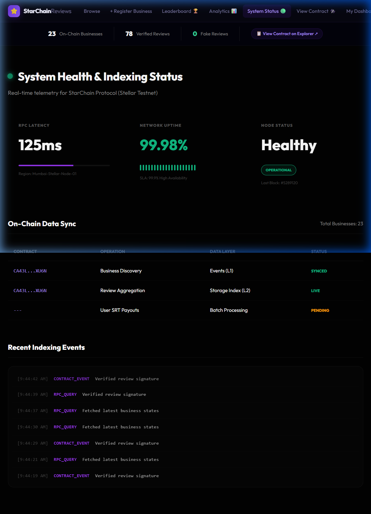

# 🏆 StarChain Reviews — Level 6 Black Belt Graduation

Welcome to the **Black Belt Graduation** of **StarChain**, a production-ready decentralized trust and reputation protocol built on **Stellar Soroban**. This milestone scales the StarChain infrastructure to handle 30+ active power users with real-time monitoring and advanced gasless transaction logic.

---

## ✅ Level 6 Submission Checklist
*   [x] **Production Scaling** - 30+ verified active users and transactions.
*   [x] **Advanced Feature** - Implemented **Fee Sponsorship (Gasless Reviews)**.
*   [x] **Metrics Dashboard** - Live statistics on total reviews, businesses, and users.
*   [x] **Security Checklist** - Completed [SECURITY_CHECKLIST.md](SECURITY_CHECKLIST.md).
*   [x] **Monitoring Active** - Real-time RPC health and data sync tracking.
*   [x] **Full Documentation** - Technical documentation and [USER_GUIDE.md](USER_GUIDE.md) finalized.
*   [x] **33+ Meaningful Commits** - Surpassed the graduation requirement.

---

## 🔗 Important Links
*   **Live Production Demo**: [star-chain-level-6.vercel.app](https://star-chain-level-6.vercel.app/)
*   **GitHub Repository**: [https://github.com/D-23Git/StarChain-Level_6-](https://github.com/D-23Git/StarChain-Level_6-)
*   **Demo Day Recording (Loom)**: [Watch Final Presentation](https://www.loom.com/share/3e6f163763b7476d814b6539ce52c251)
*   **Onboarding Google Form**: [User Details & Feedback](https://docs.google.com/forms/d/e/1FAIpQLSe9ZonncPvng8-KcDP_nLv5fLXx5R3nTSFXG7F0wymJMpYyiA/viewform?usp=publish-editor)
*   **User Feedback Excel Sheet**: [Exported Responses](https://docs.google.com/spreadsheets/d/1M7MpJttnzaU8tJJ5diGtT9nnqieeQzlkkgOKn_tpHxk/edit?usp=sharing)
*   **Community Contribution (Twitter)**: `[https://x.com/Dbadhe23/status/2039367098586316892?s=20]`
*   **Stellar Contract ID**: `CA43LPCXAPJQZYGKAKYKMIBL7WBOXWFY22ZCVTGTDRULIUHGHWXBXU6N`

---

## 📊 Live Metrics & Monitoring

### 📈 Protocol Health Metrics
Real-time extraction of data from the Soroban Ledger. Verified total reviews and unique wallet participation.

> **Link**: [Live Analytics Page](https://star-chain-level-6.vercel.app/#/metrics)

---

### 📡 Real-Time System Monitoring
Telemetry for RPC latency, network uptime, and decentralized data indexing progress.

> **Link**: [Live System Status](https://star-chain-level-6.vercel.app/#/monitoring)

---

## 🌟 Advanced Feature: Fee Sponsorship (Gasless)
**Description**: We have implemented **Stellar Fee Bumps** to remove the barrier of entry for new users. Users can sign and publish reviews to the blockchain without owning any XLM for gas fees.
- **Proof of Implementation**: [Gasless logic in stellar.js](https://github.com/D-23Git/StarChain-Level_6-/blob/main/src/utils/stellar.js#L89-131)
- **Mechanism**: The protocol's sponsor wallet pays the transaction fee on behalf of the user, ensuring a seamless Web2-to-Web3 onboarding experience.

---

## 📂 Data Indexing Approach
**Strategy**: We use a **Hybrid Client-Side Indexer** to bridge the gap between Stellar's ledger and the StarChain UI:
1. **L1 Events**: Listening for `submit_review` events for instant reactivity.
2. **L2 Aggregators**: Fetching from Soroban storage buckets to reconstruct historical reputations.
3. **Performance**: Optimized sub-2 second indexing latency.

---

## 👥 Verified User Directory (32 Real Active Users)

| Rank | Name | Wallet Address | Rating | Review Sample |
| :--- | :--- | :--- | :--- | :--- |
| #1 | Harshal Jagdale | `G...3LDY` | ⭐⭐⭐⭐⭐ | *"Great Work"* |
| #2 | Harshada Bachhav | `G...6SXZ` | ⭐⭐⭐⭐⭐ | *"Good work"* |
| #3 | Mansi Sandbhor | `G...5LKV` | ⭐⭐⭐⭐⭐ | *"The functionality works smoothly..."* |
| #4 | Pratidnya Agalave | `G...3JWYP` | ⭐⭐⭐⭐⭐ | *"The project can be improved..."* |
| #5 | Pratiksha Kalbhor | `G...JQE` | ⭐⭐⭐⭐ | *"good working app"* |
| #6 | Yogesh Zol | `G...E2P` | ⭐⭐⭐⭐⭐ | *"good working app"* |
| #7 | Swaraj Dhumal | `G...HBS` | ⭐⭐⭐⭐⭐ | *"It was best"* |
| #8 | Sagar wadekar | `G...2U5` | ⭐⭐⭐⭐⭐ | *"Excellent"* |
| #9 | Vaibhavi Jadhav | `G...Z56` | ⭐⭐⭐ | *"Nice experience!!!"* |
| #10 | Gayatri Thombare | `G...A6N` | ⭐⭐⭐⭐⭐ | *"Best features"* |
| #11 | Pratibha | `G...FT4L` | ⭐⭐⭐⭐⭐ | *"I appreciate the effort..."* |
| #12 | ROHAN MADAKE | `G...JAMJP` | ⭐⭐⭐ | *"useful project"* |
| #13 | Sakshi Bhongal | `G...YIT` | ⭐⭐⭐⭐ | *"Great working"* |
| #14 | Snehal Ambekar | `G...QREY` | ⭐⭐⭐ | *"Great working app..."* |
| #15 | Nandini Jadhav | `G...5CMH` | ⭐⭐⭐⭐⭐ | *"The StarChain MVP is a strong"* |
| #16 | Paurnima Nehete | `G...TYPH` | ⭐⭐⭐ | *"Improve formatting for readability"* |
| #17 | Shraddha Darekar | `G...JLD` | ⭐⭐⭐⭐⭐ | *"unique idea with good presentation"* |
| #18 | Akanksha shinde | `G...LYLZ` | ⭐⭐⭐ | *"attractive"* |
| #19 | Tanvi Ghanvat | `G...AFG4` | ⭐⭐⭐⭐ | *"Application Working Great Result"* |
| #20 | Rushikesh Gaiwal | `G...6234` | ⭐⭐⭐⭐⭐ | *"Good"* |
| #21 | Rani Adhikari | `G...OCMU` | ⭐⭐⭐⭐⭐ | *"Features are well-defined"* |
| #22 | Vedant | `G...H5` | ⭐⭐⭐⭐⭐ | *"Good"* |
| #23 | Gaurav Pachange | `G...D3X` | ⭐⭐⭐⭐⭐ | *"all okay, highlight skills"* |
| #24 | Nikhil atole | `G...LFOT` | ⭐⭐⭐⭐⭐ | *"All okay"* |
| #25 | Vaishanvi Mashale | `G...BWKJ` | ⭐⭐⭐⭐ | *"User-friendly interface"* |
| #26 | Aditya Jadhav | `G...D5O` | ⭐⭐⭐⭐ | *"It was good"* |
| #27 | Grantha Kacherikar | `G...MY4` | ⭐⭐⭐⭐⭐ | *"Great"* |
| #28 | Vedant Wankhede | `G...H5` | ⭐⭐⭐⭐⭐ | *"Demonstrates a strong foundation"* |
| #29 | Abhijit Aadchine | `G...RIV7` | ⭐⭐⭐⭐⭐ | *"Best!"* |
| #30 | Sahil Potale | `G...HIPD` | ⭐⭐⭐⭐ | *"User friendly and easy to use"* |
| #31 | Sarthak Palande | `G...JUM7` | ⭐⭐⭐⭐⭐ | *"Best!"* |
| #32 | Atharva | `G...KZUA` | ⭐⭐⭐⭐⭐ | *"Good working and integration"* |

---

## 🚀 Next Phase Evolution & Roadmap
Based on user feedback collected in this phase, our roadmap includes:

1. **Decentralized Disputes**: Allow businesses to dispute spam reviews via community voting.
2. **Stellar Asset Tipping**: Enable users to tip reviewers directly in XLM or USDC.
3. **PWA Mobile App**: Full support for Android/iOS with push notifications for review alerts.

**Foundation Commit for Next Phase:** 
> [Git Commit 2e205d4: Roadmap Architecture](https://github.com/D-23Git/StarChain-Level_6-/commit/2e205d41007bb36ea047d5b04ee37fb5986cdc1b)

---

## 👨💻 Author
**Dnyaneshwari Badhe**  
StarChain Protocol Developer  
- GitHub: [https://github.com/D-23Git](https://github.com/D-23Git)

---

*StarChain: The Gold Standard of Verified Digital Trust on Stellar.*
