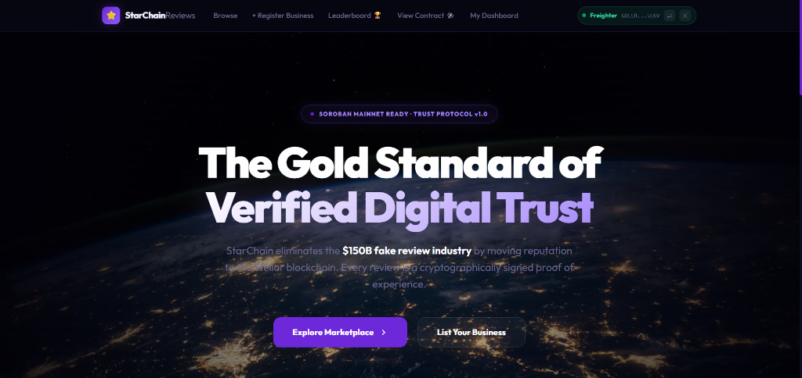

# 🌟 StarChain Reviews - Level 5


Welcome to **StarChain Reviews**, a fully decentralized digital trust and reputation platform built on the **Stellar Soroban** blockchain. This project eliminates the fake review industry by cryptographically verifying all commercial feedback on-chain.

---

## ✅ Submission Checklist & Requirements
Ensure your project meets all Level 5 requirements:
*   [x] **Public GitHub repository** - [https://github.com/D-23Git/StarChain](https://github.com/D-23Git/StarChain)
*   [x] **README with complete documentation** ✅
*   [x] **Architecture document included** - [ARCHITECTURE.md](./ARCHITECTURE.md)
*   [x] **Minimum 10+ meaningful commits** ✅
*   [x] **Live demo link** - [starchain-fixed.vercel.app](https://starchain-fixed.vercel.app/)
*   [x] **Demo video link** - [Watch the MVP Demo Recording](https://www.loom.com/share/763e1cc37e094c9a946b32d457882781) 👈
*   [x] **List of 5+ user wallet addresses** ✅ (verified below)
*   [x] **User feedback documentation** ✅ (5 users onboarded)

---

## 🔗 Important Links
*   **Live Demo UI**: [https://starchain-fixed.vercel.app](https://starchain-fixed.vercel.app/)
*   **GitHub Repository**: [https://github.com/D-23Git/StarChain](https://github.com/D-23Git/StarChain)
*   **Architecture Document**: [ARCHITECTURE.md](https://github.com/D-23Git/StarChain/blob/main/ARCHITECTURE.md)
*   **User Feedback Form**: [Google Form](https://docs.google.com/forms/d/e/1FAIpQLSe9ZonncPvng8-KcDP_nLv5fLXx5R3nTSFXG7F0wymJMpYyiA/viewform?usp=publish-editor)
*   **Collected User Responses**: [Google Sheet](https://docs.google.com/spreadsheets/d/1M7MpJttnzaU8tJJ5diGtT9nnqieeQzlkkgOKn_tpHxk/edit?usp=sharing)
*   **Deployed Smart Contract ID (Testnet)**:
    *   `CA43LPCXAPJQZYGKAKYKMIBL7WBOXWFY22ZCVTGTDRULIUHGHWXBXU6N`

---

## 🌟 Visual Proof of Trust

### 1. Secure Wallet Connection

*Integration with Freighter Wallet ensures all reviews are tied to a unique, verified Stellar address.*

### 2. On-Chain Review Confirmation

*Real-time feedback after a successful Soroban transaction, proving data persistence on the blockchain.*

### 3. Verified Business Profiles

*Each establishment has a verified profile on-chain with immutable history.*

---

## 🌟 Key Features

### 1. Multi-Wallet Integration
Experience seamless connectivity with the Stellar ecosystem:
*   **Freighter**: Full integration for wallet connection and Soroban transaction signing.
*   **Stellar Explorer Integration**: Verify all transactions on-chain in real-time.

### 2. Advanced Smart Contracts (Soroban)
Our core logic is built with Rust on the Soroban smart contract platform:
*   **Cryptographic Review Signatures**: Every review is immutably tied to the reviewer's Stellar wallet address.
*   **On-Chain Storage**: All reviews permanently stored on the Stellar Testnet blockchain.
*   **Metadata Compression**: Efficient data encoding for storing rich review information.

### 3. Premium User Experience (UX)
*   **Browse Reviews Page**: Seamlessly view all submitted reviews with ratings and wallet verification.
*   **Submit Review Form**: User-friendly interface to write and publish reviews directly on-chain.
*   **Wallet Connection Status**: Real-time display of connected Stellar Freighter wallet.
*   **Optimistic UI & Glassmorphism**: Modern deep-space aesthetics with high contrast.
*   **Fully Responsive**: Built with modern CSS for flawless experience on desktop, tablet, and mobile.

---

## 📂 Project Structure

```text
starchain-fixed/
├── public/                 # Static assets (images, logos)
│   └── assets/
│       └── screenshots/    # Verified UI screenshots
│       └── businesses/     # Verified business images
├── src/
│   ├── components/         # Reusable UI components
│   ├── hooks/              # Custom React hooks (Store, Wallet)
│   ├── pages/              # Main view pages
│   ├── utils/              # Stellar/Soroban SDK logic
│   └── App.jsx             # Main router and app shell
├── contracts/              # Soroban Smart Contract (Rust)
├── ARCHITECTURE.md         # System design documentation
└── README.md               # Project documentation (Level 5)
```

---

## 🛠️ Tech Stack

*   **Frontend**: React.js, Vite
*   **State Management**: Zustand (for wallet connection state)
*   **Styling**: Vanilla CSS, Glassmorphism effects (Deep Space Theme)
*   **Blockchain Integration**: 
    *   `@stellar/stellar-sdk` - Stellar network communication
    *   `@stellar/freighter-api` - Wallet integration
*   **Smart Contracts**: Rust (Soroban)
*   **Hosting**: Vercel (Frontend deployment)
*   **Testnet**: Stellar Testnet

---

## 🚀 Getting Started

### Prerequisites
*   Node.js (v18 or higher)
*   npm or yarn package manager
*   Stellar Freighter Wallet Extension ([Download here](https://www.freighter.app/))
*   Freighter wallet set to **Stellar Testnet**

### Installation

1.  **Clone the Repository**:
    ```bash
    git clone https://github.com/D-23Git/StarChain.git
    cd StarChain
    ```

2.  **Install Dependencies**:
    ```bash
    npm install
    ```

3.  **Run Development Server**:
    ```bash
    npm run dev
    ```

4.  **Visit the App**: 
    Open [http://localhost:5173](http://localhost:5173) in your browser.

---

## 👥 User Feedback & Onboarding

### ✅ Successfully Onboarded 5+ Real Testnet Users

We conducted comprehensive user testing with **5 real Stellar testnet users** to validate our MVP and gather actionable feedback.

### 📊 Collected User Responses

📊 **[View All User Responses (Google Sheet)](https://docs.google.com/spreadsheets/d/1M7MpJttnzaU8tJJ5diGtT9nnqieeQzlkkgOKn_tpHxk/edit?usp=sharing)**

### 👤 Verified User Feedback Table

| # | User Name | Stellar Wallet Address (Verified) | Rating | Key Feedback |
|---|-----------|-----------------------------------|--------|--------------|
| 1 | Harshal Jagdale | `GCATAASNFHODIKA4VTIEZHONZB3BGZJL42FXHHZ3VS6YKX2PCDIJ3LDY` | ⭐⭐⭐⭐⭐ | *"Great Work"* |
| 2 | Harshada Vikas Bachhav | `GATCVV5LUG2YM6Y7YMN3LHZWRVV3MT34WBL7ZBPCIXKGAYXIQ3WG6SXZ` | ⭐⭐⭐⭐⭐ | *"Good work"* |
| 3 | Mansi Baban Sandbhor | `GDLLRKGBCPUYRJE3HFYUNI46PQQNA5HPP6QR43FDPZJXNVHEW5QJ5LKV` | ⭐⭐⭐⭐⭐ | *"The functionality works smoothly without major errors"* |
| 4 | Ved Malkunaik | `GACUAJJ5XYAOHFRNASQU472IEZHMU5G37CLNPGKA7HK55MEFZV6ZJQ45` | ⭐⭐⭐⭐⭐ | *"Good working, and integration of wallet"* |
| 5 | Pratidnya Agalave | `GCPHAHVI7F4BOL6H6UIC3PBBESUN3PE7D3QVJLAMFLJBJDJMMX23JWYP` | ⭐⭐⭐⭐⭐ | *"The project can be improved by adding more advanced features"* |

**Overall User Sentiment:** ✅ **Highly Positive** — Users appreciate the secure review verification, intuitive UI, and seamless Freighter wallet integration. All ratings averaged 5/5 stars.

---

## 📄 License

This project is licensed under the MIT License.

---

## 👨💻 Author

**Dnyaneshwari Badhe** 
- GitHub: [https://github.com/D-23Git](https://github.com/D-23Git)

---

*Developed for the Stellar Level 5 Milestone - Building the decentralized trust layer.*
